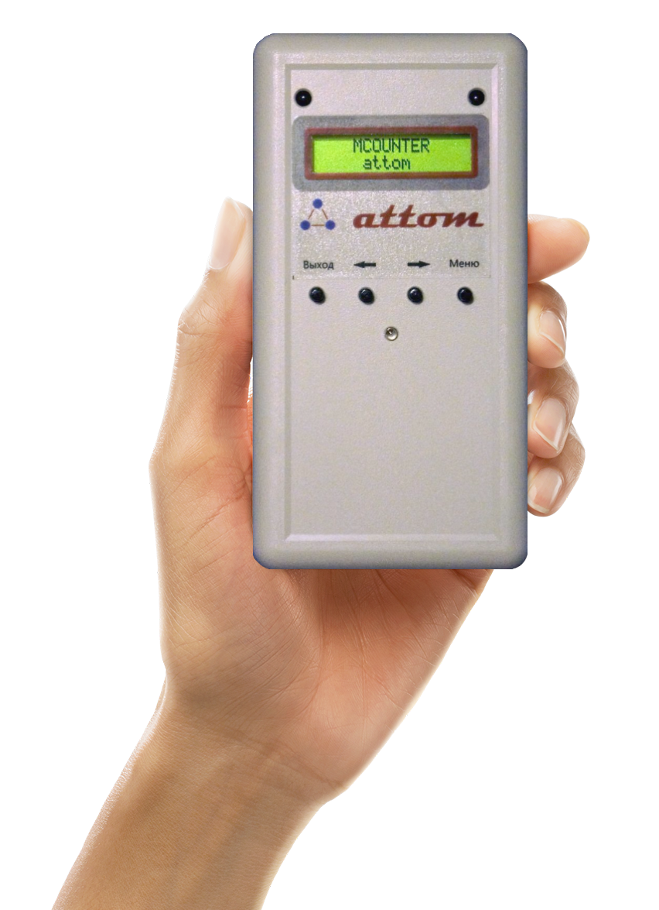

# **Battery Counter**

A fully autonomous counter of visitors - **MCounter attom**.

This small device can work approximately 1 year with just 2 *LiSOCl2* AA batteries. And it can be assembled manually in small lab without expensive equipment and components used. All parts of this device was designed by me. Main purpose why I share this project - it's demonstration of my skills (part of my portfolio). Fill free use it under [GNU GPL v3](./LICENSE) license terms.

I have no much time to provide good documentation for this projects. But I believe it's well-structured even for people with minimal experience in Embedding Devices. PCB layouts includes mechanical layers which can be visualized in 3D to easy understand location of all components and it physical sizes.

*The photo of the real prototype of the device receiver, manually assembled by me. Hand on the background is not mine :)*

**Brief description**

The device is used for automatic counting of people in shopping centers. It consists of 2 parts: Transmitter and Receiver. Device contains small LED digital display with backlight and keyboard with 4 keys. Principle of work: IR (infra-red) rays emitted by Transmitter can be interrupted by passed human. These short termination of IR rays are detected by Receiver and recorded in internal memory, aggregated by hours, days, weeks, months and displayed in the form of different reports on the small device display. Device has good system of noise suppression and can work in different environments and under different conditions.

* Hardware part is designed in the Altium Designer 14.3.10 - [www.altium.com](https://www.altium.com/)
* Software part is designed in the IAR Embedded Workbench for AVR V6.12.1 - [www.iar.com](https://www.iar.com/)
* Menu Builder was designed on C# .NET in VS 2012.
* Receiver microcontroller - **Atmega328P**
* Transmitter microcontroller - **Atmega48PA**
* User documentation (in Russian) - [mcounter_attom_user_guide.pdf](https://mcounter.com.ua/filesdocs/mcounterx/mcounter_attom_user_guide.pdf)

**Project content**
* [micro](./micro) - folder with source code for device Receiver and Transmitter parts.
* [micro/BattRX](./micro/BattRX) - Receiver project.
* [micro/BattTX](./micro/BattTX) - Transmitter project.
* [schemas](./schemas) - folder with component library, board rules and PCB layouts designed in Altium Designer.
* [schemas/Common/Rules](./schemas/Common/Rules) - board rules for Altium Designer.
* [schemas/Common/Library](./schemas/Common/Library) - component library for Altium Designer.
* [schemas/BatteryCounter](./schemas/BatteryCounter) - PCB layouts for Receiver and Transmitter parts.
* [other/LCDMenuBuilder](./other/LCDMenuBuilder) - menu builder - C# .NET program to design and build device menu, use it to translate menu. Program converts menu in set of UserInterface* header and cpp files. Specify target path to [micro/BattRX](./micro/BattRX) and files will be automatically added in the project.
* [LICENSE](./LICENSE) - GNU GENERAL PUBLIC LICENSE v3.

*Thank you for your interest!*
